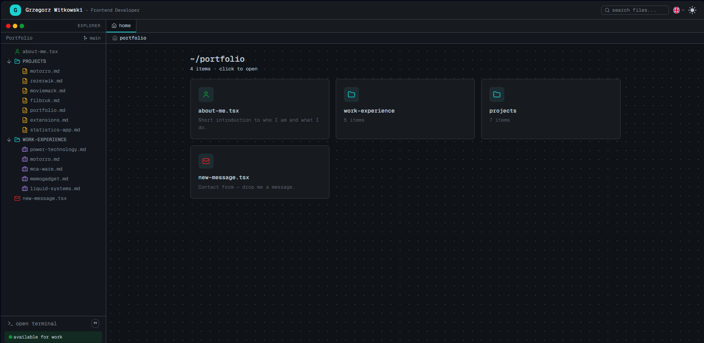
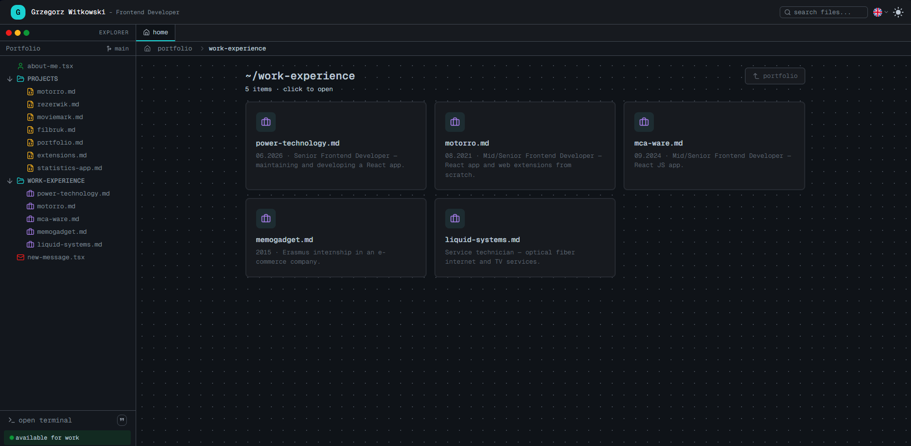
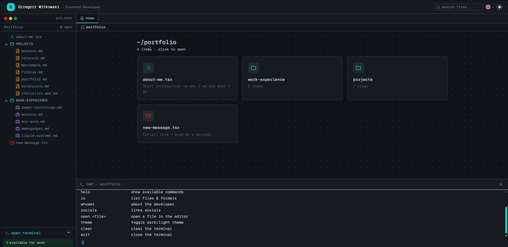
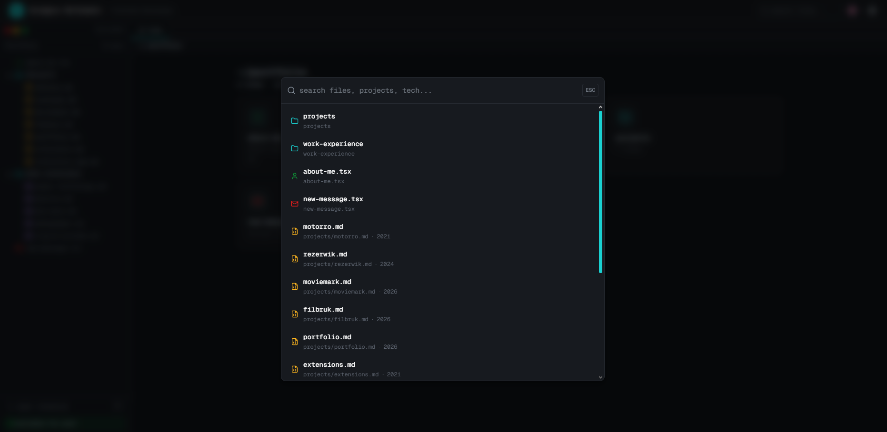

# Grzegorz Witkowski — Portfolio

An interactive, IDE-inspired portfolio application that presents work experience, projects, and contact information through a file explorer, a command terminal, and a search command palette.









## Stack

- React 19, TypeScript
- Create React App (react-scripts)
- Material UI v7 + Emotion (`@mui/material`, `@mui/icons-material`)
- Zustand — state management
- react-i18next — localization (EN / PL)
- lucide-react — icons
- Geist Mono variable font
- Prettier — code formatting
- gh-pages — deployment

## Running

From the project root:

```bash
npm install          # or: yarn
npm start            # or: yarn start   → http://localhost:3000
```

Other scripts:

```bash
npm run build        # or: yarn build      — production build
npm run format       # or: yarn format     — Prettier write + check
npx tsc --noEmit     # or: yarn tsc        — typecheck
```

## Features

- **Terminal** — open it from the side panel footer. Supported commands:
  `help`, `ls`, `whoami`, `socials`, `open <file>`, `theme`, `clear`, `exit`.
  Commands are echoed, arrow-up recalls history, and unknown commands return a red error.
- **File explorer & folders** — IDE-style sidebar with nested folders, open
  tabs with icons, breadcrumbs, and folder views on the home workspace.
- **Search** — command palette in the header (opened with the search icon) with
  a blurred backdrop. It filters all files and folders by name and technology
  stack, and clicking a result opens the matching file or folder. `ESC` closes
  the palette and resets the query.
- **Projects with demos** — detail views for each project with an image
  carousel, key features, stack badges, and live demo / code links.
- **Extras** — work-experience detail views, contact form, English / Polish
  localization, and a light/dark theme toggle.

## Hosting

Deployed to GitHub Pages:

https://grzegorzwitkowsk1.github.io/Portfolio/

Deploy with `npm run deploy` (builds the app first, then publishes the `build`
folder via gh-pages). The `homepage` field in `package.json` points to the
deployed URL.
